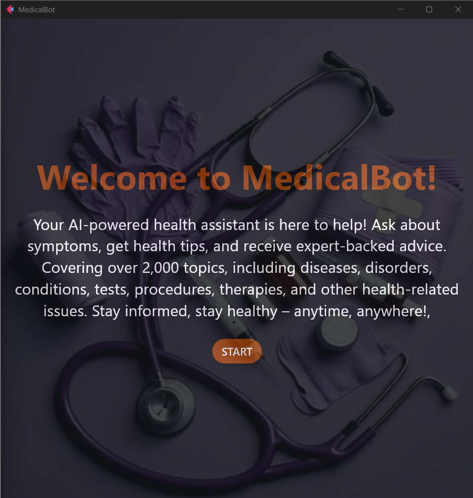
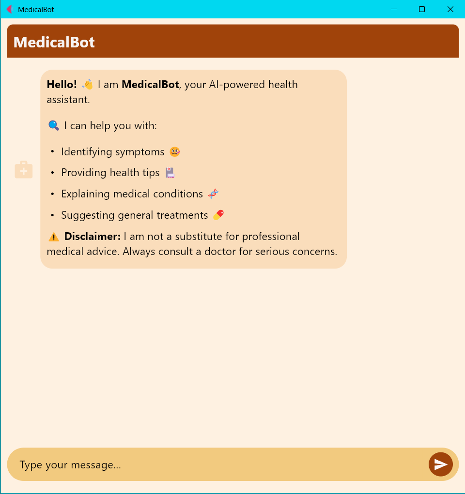
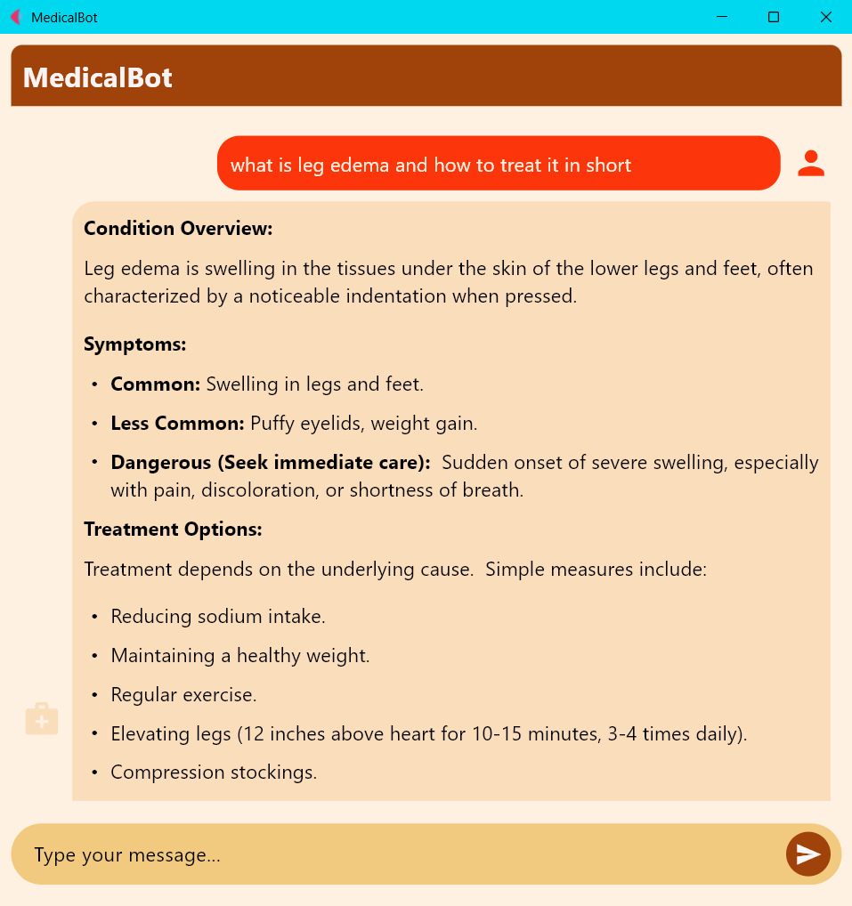
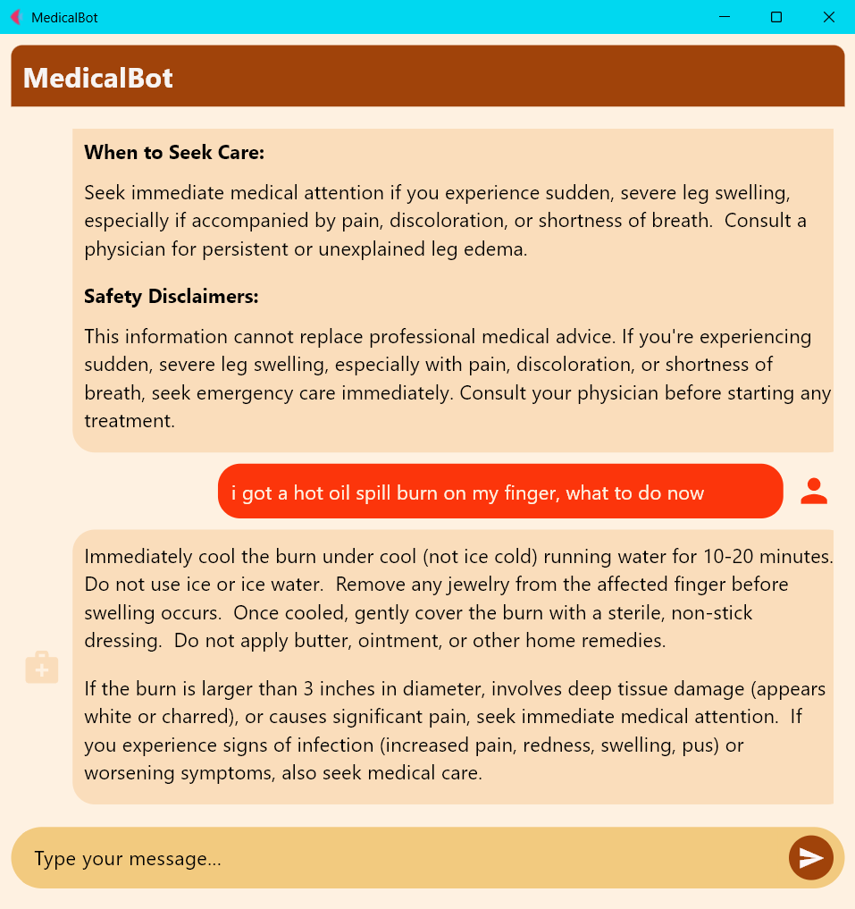

# 🏥 MedicalBot - AI-Powered Health Assistant

Your AI-powered health assistant is here to help! Ask about symptoms, get health tips, and receive expert-backed advice. Covering over **2,000+ topics**, including diseases, disorders, conditions, tests, procedures, therapies, and other health-related issues. **Stay informed, stay healthy – anytime, anywhere!**

MedicalBot is an **AI-powered medical chatbot** designed to provide **accurate, reliable, and actionable medical information** using Retrieval-Augmented Generation (RAG). It utilizes **FAISS vector stores, Gemini-1.5 AI, and advanced reranking models** to deliver context-aware, evidence-based responses.

---

## 🛠 Features
✅ **AI-Powered Health Assistant** - Get medical insights backed by AI models. 
✅ **Retrieval-Augmented Generation (RAG)** - Combines document retrieval with AI-generated responses. 
✅ **MultiQuery Retrieval** - Enhances search results by rephrasing queries for better document coverage. 
✅ **FAISS Vectorstore** - Efficient indexing and searching of medical knowledge base. 
✅ **Cross-Encoder Reranking** - Improves search relevance by reordering results. 
✅ **Iterative Response Refinement** - Enhances medical answer quality through multiple evaluation cycles. 
✅ **Query Classification** - Automatically differentiates between medical and non-medical queries. 
✅ **Safety-Focused** - Includes disclaimers and highlights urgent care situations. 

--- 📷 Screenshots

---

## 🏥 How It Works
1️⃣ **User Query Classification** - Determines if the question is medical or non-medical. 
2️⃣ **MultiQuery Retrieval** - Generates multiple variations of the query for better document retrieval. 
3️⃣ **FAISS Search** - Searches the medical knowledge base for relevant documents. 
4️⃣ **Cross-Encoder Reranking** - Sorts documents based on relevance to the query. 
5️⃣ **RAG Pipeline** - Extracts key context from documents and generates an AI-powered response. 
6️⃣ **Response Evaluation & Refinement** - Iteratively improves response quality using AI scoring. 

---

## ⚠️ Medical Disclaimer
> **MedicalBot provides informational content only.** It does **not** replace professional medical advice, diagnosis, or treatment. If you have a medical emergency, **consult a doctor immediately.**

---

## 💡 Stay Healthy, Stay Informed!
Your AI-powered medical chatbot is here to assist you 24/7! 🚀
